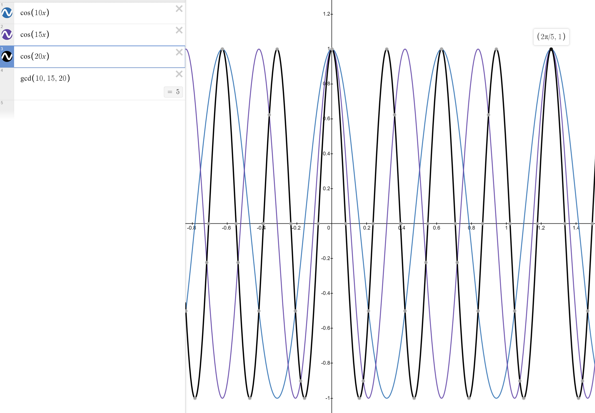

# A WebGL-WASM-Powered Spirograph Generator

## Foreword

This is project is first and foremost, my playground, where multiple ideas are tried and tested and are fully leveraged elsewhere. I initially wanted to just make a quick spirograph generator, but then stumbled into various (exciting and frustrating) rabbit holes, each hole an entire realm worth exploring on their own. They result in, dare I say, a cacophony of ideas, of trials and errors.

There are some features that I eventually stopped working on because it's been almost 2 years of me stopping and picking up where I left of like the backend integration(sorry, you only get local storage for now), some fancy UI upgrades and smaller screens support. This project was burning me out and I needed to finish it fast.

Nontheless, there are still some cool discoveries I have made that I think are worth being documented.


## Your childhood's favorite spirograph toy, but beefed up.

This spirograph generator contains 2 modes: 

1. The __animated mode__, which draws n-nested level of cycloids at 60fps. This is done on the main thread, so the frames could dip significantly if your cpu is not very powerful for single-threaded operations. I didn't take time to optimize it as it really isn't why this project exist. 
2. The __instant mode__, the reason I made this project in the first place. This mode draws very, very fast. It also guarantees that for Global Time Scale of around 1, the shape that is drawn will be a complete shape. The algorithm is discussed below, along with other implementation details.

# Parameters

## Local (affects the selected cycloid only)

`rodLengthScale`: 1 means the rod is the same length as the cycloid it belongs to. This rod extends the physical boundary in that in a real spirograph, the position of the rod cannot be farther from the origin than the radius of the circle.

`cycloidSpeedScale`: the ratio of the surface covered as the child cycloid moves around the parent. The value of 1 means there are no sliding (physically accurate).

`moveOutsideOfParent`: whether the curent cyclod is positioned within or outside of its parent cycloid. 

`radius`: The radius of the current cycloid.

`rotationDirection`: this is not the self-rotation direction, but the direction in which the current cycloid moves around its parent (going left or going right).

`selectedCycloid`: the cycloid whose parameters you would like to change.

## Global (affects every cycloids)

`globalTimeStep`: controls the iterations needed until an image is fully drawn. The higher the value, the lower the iterations...and resolution. However, set the value too low, and the image will take too long to be drawn in the animated mode, and use more power in the instant mode (more iterations).

`clearTracedPathOnParamsChanged`: whether or not to clear the already-traced paths in animated mode when the paramters are changed.

`outerBoundingCircleRadius`: the radius of the base circle. 

`showAllCycloids`: whether or not to show all cycloids (the circles). Works only in animated mode.

`traceAllCycloids`: whether or not to trace the paths of all cycloids. Works only in animated mode.

`displayedCycloid`: the cycloid whose path is currently being traced.

# The Modes

## Animated


The simplest of modes, this mode adds up the position of the current point every frame based on the current parameters of each cycloids, adding one on top of another. Nothing much to mention, I didn't even bother optimizing this and move it to another worker thread. Exciting things happen in the other mode, so let's go there instead.

## Instant


This is where most of the work goes. The rendering is done in the worker thread with an offscreen canvas. Wasm and WebGL are both used here alongside a custom algorithm to help make sure that we get the full, or the contour of the shape, depending on the `globalTimeStep` property, as fast as possble. 

__A brief overview of how it's done__, more detial below: grab all properties from the main thread, pass them all to the worker thread, the worker thread then sends the parameters to Rust to calculate how many points to draw for a complete shape, then calculates the position for each of the points, again, with Rust, and then pass that back to JavaScript. Now, with the positions of the vertices available (hopefully not too many points until the heap oveflows :p) in memory, we pass all of that to WebGL's `drawArrays` and all lines are drawn at once.

### The Algorithm

The problem with numeric methods is that it's long, and you don't know when it'll end, or if the end is really the end?! Too few iterations and the shape won't be complete, and too many means wasting computation time.

Let's say we check

```ts
if (currentPoint.xy === beginningPoint.xy) {
    draw();
}
```

every iteration, what's going to happen is that for shapes other than the simple geometric 2d shapes, this will not draw the full shape. Given complex enough shapes, lines will cross and the check will fail.

Okay, let's say we now just keep drawing for say, a million iterations, that'll for sure get the complete shape, right? Right, but those over-draw will make the lines too thick that we can't really make out the finer details of the shape.

Worse, every shape will just take super long.

__Our solution__ would be to find out how many iterations each shape need.

Let's begin with the formula.

Right now, we build each circle on top of one another, and each movement of the circle is affected by the product of the scalars of all circles below it. This can be described as:


$$ p_{final} = \sum_{i=0}^{n} \cos(\theta \lambda - \frac{\pi}{2}k)(r_{p} + r_{c}) $$

Where $p_{final}$ represents the final position, either `p.x` or `p.y` of the current point. $n$ is the total number of cycloids considered in the calculation. $k$ is a constant with a value of either 1 or -1, used to offset the cosine function and determine whether the cycloid is inside or outside of its parent. $r_p$ and $r_c$ are the radii of the parent of the current cycloid and the cycloid itself, respectively. $\theta$ is the current angle of the cycloid. And $\lambda$ is a scalar that determines the speed at which the cycloid moves around its parent.

Yes I am sounding very pretentious. I should know, because I didn't start with the equation, I just wanted to try typing out LaTeX. The mathy description above was also paraphrased by ChatGPT.  I actually started with this:

```ts
  for (let i = 1; i < cycloids.length; i++) {
      const parentCycloid = cycloids[i - 1];
      const thisCycloid = cycloids[i];
      const childCycloidRadius = thisCycloid.isOutsideOfParent
        ? thisCycloid.radius
        : -thisCycloid.radius;
      const isChildArcClockwise =
        thisCycloid.rotationDirection === "clockwise"; // js hack, true is 1, and false is 0

      // We ask the child it needs the parent to scale its theta.
      finalPoint.x +=
        (parentCycloid.radius + childCycloidRadius) *
        Math.cos(
          theta * thisCycloid.thetaScale - Math.PI * 0.5 * isChildArcClockwise 
        );
      finalPoint.y +=
        (parentCycloid.radius + childCycloidRadius) *
        Math.sin(
          theta * thisCycloid.thetaScale + Math.PI * 0.5 * isChildArcClockwise
        );
    }
```

then I turned it into Rust, with a few optimizations (that are totally not necesary, but did it anyway because it was actually kind of fun):

```rs
pub fn compute_epitrochoid(
    data: *const [f64; 3],
    data_len: usize,
    theta: f64,
    rod_length: f64,
    new_point: &mut [f64; 2],
) {
    *new_point = [0.0, 0.0];
    // Don't ask why I used unsafe, I forgot :| Something something with not doing borrow checking.
    unsafe {
        for i in 0..data_len {
            let d = *data.add(i);
            new_point[0] += d[0] * (theta * d[2] - d[1]).cos();
            new_point[1] += d[0] * (theta * d[2] + d[1]).sin();
        }

        new_point[0] += rod_length * theta.cos();
        new_point[1] += rod_length * theta.sin();
    }
}
```

Okay. Now we know how to sum up the final position of our points. But we still don't know how many iterations we need. 
Let's first think about each rotation as just 2 different pair of 2 trig functions ${cos(x)}$ and ${cos(0.5x)}$, and ${cos(2x)}$ and ${cos(3x)}$.


In the case of a cosine, the second time $cos(\theta_{1})$ and $cos(\theta_{2})$ equal ${1}$ is the moment we know we need to stop the iteration.

So this means that we can just keep looping until we hit ${1}$...right?:

```ts
  const stepsNeededForEachIteration = 60;
  const k = (Math.PI / 2) / stepsNeededForEachIteration;
  for (let i = 0; i < Number.Infinity; i++) {
    const theta = 0.289;
    const phi = 0.948;
    const whateverGreekLetterIsNext = 2.99;
    while(Math.cos(theta) === 1 && Math.cos(phi) === 1 && Math.cos(whateverGreekLetterIsNext) === 1) {
      draw();
      theta += k;
    }
  }
```

Of course not. Like, we are doing numerical integration, this means that there is a chance theta + k will never be one, especially when there are a lot of decimal places or when there are more than a few scalars. We NEED to find out ahead of time, and the algorithm must not be _O(n)_, we need something FASTER. 

There are actually two things that could help us here from our elementary math classes: gcd and lcm.

We would like to find out basically when ${n}$ numbers "collide", which is a perfect problem from our two friends! But the question now is...which one do we need?

Looking back at the graphs above, it seems that as our scalars increase, the rate ${x}$ position at which they become synchronized on the graph is lower, and vice versa. Okay...so everything is going backwards, larger number collide faster and smaller numbers slower...which makes sense for trig functions right? Larger scalar means faster oscillations, and smaller, slower. Now, which of those two (gcd and lcm) kind of goes along this line? 

A refresher: lcm returns a number that is divisible by each of the numbers passed as argument, and gcd returns the number that all input numbers are diviible by.

```ts
lcm(8, 12); // 24
lcm(2, 5, 6); // 30
lcm(10, 100, 200) // 200
gcd(8, 12); // 4
gcd(2, 5, 6); // 1
gcd(10, 100, 200) // 10
```

Clearly, gcd is what we need here. It conforms to our large is small and small is large intuition.

Let's try to use it to predict when two cosine functions collide. We'll try with integers first, and then move on to decimals, we'll have to modify this upcoming solution a bit to compute the latter.

Let's see, when do you think ${cos(10x)}$, ${cos(20x)}$ and ${cos(15x)}$ collide?

__Answer__: gcd(10, 20, 15) => 5

Yay! It's five! Wait. Five what, like five and then how do I use this "five"? Let's pull up Desmos again.



It's ${\frac{2\pi}{5}}$ because our ${2\pi}$ oscillation is now 5 times faster.

This gets us one step closer to our final equation.

For now, if we were to use what we know and construct a function, we'd get:

```ts
const baseStep = Math.PI * 2 / 60; // 1 rotation in 60 frames.
const scalars = [...]; // any number of integer scalars
const finalPoints = findPoints(scalars, baseStep);

for (let i = 0; i < finalPoints.length; i++) {
  const p = getPositionOfPoints(finalpoints[i]); // We haven't covered this yet.
  draw(p);
}
```


### WebGL

I wrote a small custom-made webgl renderer because other options are too generic and would definitely bloat the project. This renderer does nothing but render a bunch of lines with and API that is not too complicated. My rendering use case is very simple, I only need 3 methods:

```ts
export default interface Renderer {
  render(): void;
  resize(newWidth: number, newHeight: number): void;
  setTransformation(mat: { x: number; y: number; z: number }): void;
}
```

The `render` method is called everytime there is a change to the parameters, a resize happens, a transformation is applied to the matrix (zoom, pan), or the focused cycloid has changed. I could have gone with caching the rendered output and added a debounce or throttle wrapper to minimize the rendering time, but doing that would mean losing the ability to see the change animating as the parameters change in real time. Instead, the `globalTimeStep` property can be used to help improve the performance, when the renderer takes too long. 

### WASM

Why Rust-WASM and not just JavaScript?

After having profiled multiple times (like a lot), WASM seems to gives better results when dealing with lower iterations. With larger iterations (~500,000 or more), JavaScript's JIT compiler comes in and steals the victory. With globalTimeStep being an option, and most combinations of cycloidSpeedScale result in iterations less than the limit that I found, I see it fitting that we go with Rust for this small calculation util. Hopefully, future improvements made to WASM will also give this function some performance boost as well.

The wasm modules, as mentioned earlier, are in charged of finding out how many points we need to draw, and the positions for each of the points. 

Could I have made this feature in JavaScript? Yes! Actually, the feature was made in JavaScript and then I later switched to Rust. JavaScript was actually not slow at all and I'm sure that had I not made the changed, the rendering would appear to the eyes just as fast. But, hey...I learned Rust!

# Notable Mentions

_Stuff that don't have anything to do with rendering the cycloids, but are interesting nontheless._

## Relationship Editor


## Zooming and Panning

TODO Talk about the webgl part as well


