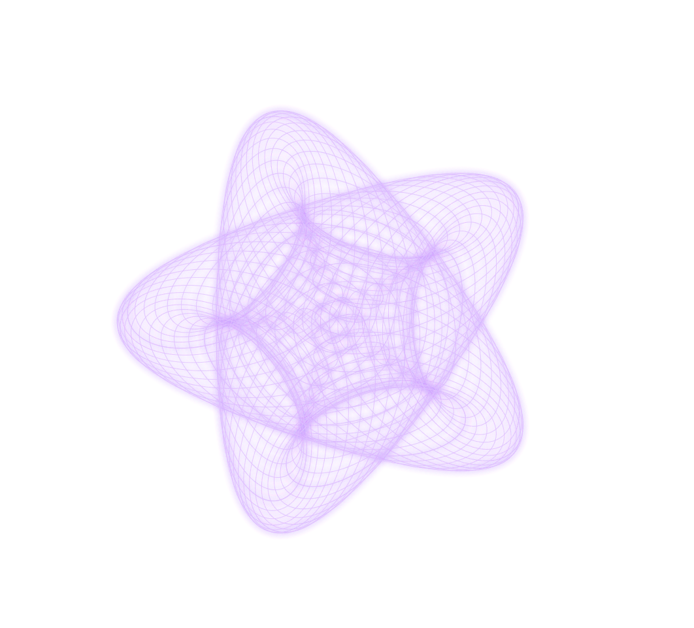

# A WebGL-Powered Spirograph Generator

## Foreword

This is project is first and foremost, my playground, where multiple ideas are tried and tested and are fully leveraged elsewhere. I initially wanted to just make a quick spirgraph generator, but then stumbled into various (exciting and frustrating) rabbit holes, each hole an entire realm worth exploring on their own. They result in, dare I say, a cacophony of ideas, of trials and errors.

Nontheless, there are still some cool discoveries I have made that I think are worth being documented.

### Some Examples Before We Begin

## Your childhood's favorite spirograph toy, but beefed up.

This spirograph generator contains 2 modes: 

1. The __animated mode__, which draws n-nested level of cycloids at 60fps. This is done on the main thread, so the frames could dip significantly if your cpu is not very powerful for single-threaded operations. I didn't take time to optimize it as it really isn't why this project exist. 
2. The __instant mode__, the reason I made this project in the first place. This mode draws very, very fast. It also guarantees that for Global Time Scale of around 1, the shape that is drawn will be a complete shape. The algorithm is discussed below, along with other implementation details.

# Parameters

## Local (affects the selected cycloid only)

`rodLengthScale`: 1 means the rod is the same length as the cycloid it belongs to. This rod extends the physical boundary in that in a real spirograph, the position of the rod cannot be farther from the origin than the radius of the circle.

`cycloidSpeedScale`: the ratio of the surface covered as the child cycloid moves around the parent. The value of 1 means there are no sliding (physically accurate).

`moveOutsideOfParent`: whether the curent cyclod is positioned within or outside of its parent cycloid. 
`radius`: The radius of the current cycloid.

`rotationDirection`: this is not the self-rotation direction, but the direction in which the current cycloid moves around its parent (going left or going right).

`selectedCycloid`: the cycloid whose parameters you would like to change.

## Global (affects every cycloids)

`globalTimeStep`: controls the iterations needed until an image is fully drawn. The higher the value, the lower the iterations...and resolution. However, set the value too low, and the image will take too long to be drawn in the animated mode, and use more power in the instant mode (more iterations).

# The Modes

## Animated

The simplest of modes, this mode numerically integrates every frame based on the current paramters of each cycloids, adding one on top of another. The simplest form of animation.

## Instant

# The Controls

