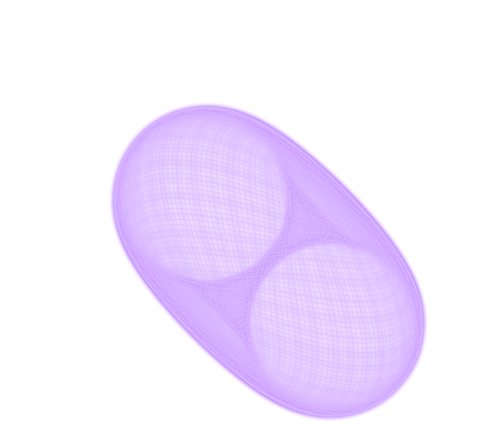
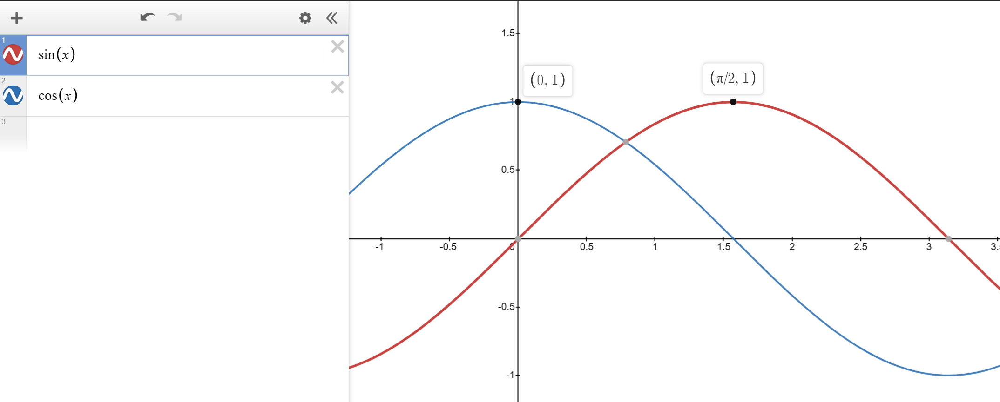

# A WebGL-WASM-Powered Spirograph Generator

## Foreword

This project is first and foremost, my playground, where multiple ideas are tried and tested and are fully leveraged elsewhere. I initially wanted to just make a quick spirograph generator, but then stumbled onto various (exciting and frustrating) rabbit holes, each hole an entire universe worth exploring on their own. They result in, dare I say, a cacophony of ideas, of trials and errors, of exploratory implementations lacking ample due dilligence 😛.

There are some features that I eventually stopped working on because it's been almost 2 years of me just pausing and picking up where I left of, like the backend integration (sorry, you only get local storage for now), some fancy UI upgrades and smaller screens support. This project was burning me out and I needed to finish it fast.

I am still undecided on why I like spirographs so much. I never grew up with them, nor have I played with a real one. It might be that it is one of not so many things that gives out ridiculously beautiful shapes with so little math. Anyway, enough with the intro, let's see what random stuff I thought worth being documented.




## Your childhood's favorite spirograph toy, but beefed up.

This spirograph generator contains 2 modes:

1. The **animated mode** draws an n-nested levels of cycloids at 60fps. This is done on the main thread, so the frames could dip significantly if your cpu is not very powerful for single-threaded operations. I didn't take time to optimize it as the allure of this next feature was too strong.

2. The **instant mode**, the reason I made this project in the first place. This mode draws very, very fast. It also guarantees that for a Global Time Scale of 1 (description below), the drawn shape is guarantee to be a complete closed-shape (ex. an ellipse, not a U-Shaped curvee). The algorithms are explored below, along with other implementation details.

# Parameters

## Local (affects the selected cycloid only)

`rodLengthScale`: 1 means the rod is the same length as the cycloid it belongs to. This rod extends the physical boundary in that you cannot put your pencil outside of a circle, only inide of it; more precisely, the position of drawn point cannot be farther from the origin than the radius of the circle.

`cycloidSpeedScale`: the ratio of the surface covered as the child cycloid moves around the parent. The value of 1 means there are no sliding (physically accurate).

`moveOutsideOfParent`: whether the curent cyclod is positioned within or outside of its parent cycloid.

`radius`: the radius of the current cycloid.

`rotationDirection`: orbit direction, left or right.

`selectedCycloid`: the cycloid whose parameters you would like to change.

## Global (affects every cycloids)

`globalTimeStep`: controls the iterations needed until an image is fully drawn. The higher the value, the lower the iterations...and resolution. However, set the value too low, and the image will take too long to be drawn in the animated mode, and use more power in the instant mode (more iterations, so, also longer, but not as long as the animated mode).

`clearTracedPathOnParamsChanged`: whether or not to clear the already-traced paths in animated mode when the paramters are changed.

`outerBoundingCircleRadius`: the radius of the base circle.

`showAllCycloids`: whether or not to show all cycloids (the circles). Works only in animated mode.

`traceAllCycloids`: whether or not to trace the paths of all cycloids. Works only in animated mode.

`displayedCycloid`: the cycloid whose path is currently being traced.

# The Modes

## Animated


The simplest of modes, this mode adds up the position of the current point every frame based on the current parameters of each cycloids, adding one on top of another. Nothing much to mention, I didn't even bother optimizing this and move it to another worker thread. The math behind this is simple, and will be explained in the next part. Exciting things happen there, not here!

## Instant


This is where most of the work went. The rendering is done in the worker thread with an offscreen canvas. Wasm and WebGL are both used here alongside a very interesting algorithm(for me) to help make sure that we get the full, or the contour of the shape, depending on the `globalTimeStep` property, as fast as possble.

**A brief overview of how it's done**, more detial below: grab all properties from the main thread, pass them all to the worker thread, the worker thread then sends the parameters to Rust to calculate how many points to draw for a complete shape, then calculates the position for each of the points, again, with Rust, and then pass that back to JavaScript. Now, with the positions of the vertices available in memory -- hopefully not too many points until the heap oveflows :p -- we pass all of that to WebGL's `drawArrays` and all lines are drawn at once.

### The Algorithm

The problem with numeric methods is that it's long, and you don't know when it'll end, or if the end is really the end?! Too few iterations and the shape won't be complete, and too many means wasting computation time.

Let's say we check

```ts
if (currentPoint.xy === beginningPoint.xy) {
  draw();
}
```

every iteration, what's going to happen is that for shapes other than simple geometric 2d shapes, this will not draw the full shape. Given complex parameters, the traced line will cross itself and the check will fail.

Okay, let's say we now just keep drawing for a million iterations, that'll for sure get the complete shape, right? Right, but we do not want to over draw a shape, because our goal here is to draw complex and beautiful shapes as fast as possible.

**Our solution** would be to find out how many iterations each shape need.

Let's begin with the formula. I'll be showing both the implementation both in code and math.

**The math part is what I used for the instant mode and the code for the animated mode.**

This is the set up code, anything I show further is implied that it's done within the second script tag. Copy and paste the following snippet in an html file.

Nevermind what they do, we'll only be using two functions, `begin`, and `drawCircle`.

```html
<!-- Just copy and paste this boilerplate code -->
<!DOCTYPE html>
<html lang="en">
  <head>
    <style>
      html,
      body,
      canvas {
        border: 0;
        padding: 0;
        margin: 0;
        width: 100%;
        height: 100%;
        display: block;
      }
    </style>
  </head>
  <body>
    <canvas id="canvas"></canvas>
  </body>
  <script>
    const canvas = document.getElementById("canvas");
    canvas.width = window.innerWidth * devicePixelRatio;
    canvas.height = window.innerHeight * devicePixelRatio;
    const ctx = canvas.getContext("2d");
    const screenCenter = {
      x: canvas.width / 2,
      y: canvas.height / 2,
    };

    function begin(callback, clearCanvas = true) {
      requestAnimationFrame((theta) => {
        ctx.clearRect(0, 0, canvas.width, canvas.height);
        if (clearCanvas) {
          callback(theta * 0.001);
        }
        begin(callback, clearCanvas);
      });
    }

    function drawCircle({ x, y, r }, fill = false) {
      ctx.beginPath();
      ctx.arc(x, y, r, 0, Math.PI * 2);
      if (fill) {
        ctx.fill();
      } else {
        ctx.stroke();
      }
    }
  </script>
  <script>
    // Stuff below goes here.
  </script>
</html>
```

## Deriving the Formula

---

Let's grab a point of size $r_{1}$ and make it rotate around an imaginary circle of radius $r_{0}$.

$r_{1}$ is not yet used in the equation, but we need it to draw the orbiting circle.

$$ r\_{0}cos(\theta) $$

$$ r\_{0}sin(\theta) $$

```js
// Create 2 radii, can be of any size, just make the first one
// larger than the second
const r0 = 600;
const r1 = 50;

// The set up code provides a simple interface that passes a delta time as the parameter, we'll use it to draw a rotating circle at the center of the screen.
begin((theta) => {
  drawCircle({
    x: screenCenter.x + Math.cos(theta) * (r0 + r1),
    y: screenCenter.y + Math.sin(theta) * (r0 + r1),
    r: r1,
  });
});
```

### Result


---

If we draw the base circle, we'll see that the orbiting circle is drawn on top of the edge of the base circle, we have to move it out by its own radius $r_{1}$.


Then we'll end up with the following equation.

$$ cos(\theta)(r*{0} + r*{1}) $$

$$ sin(\theta)(r*{0} + r*{1}) $$

```js
const r0 = 600;
const r1 = 50;
const baseCirclePosition = { x: screenCenter.x, y: screenCenter.y };

begin((theta) => {
  // draws the base circle.
  drawCircle({
    x: baseCirclePosition.x,
    y: baseCirclePosition.y,
    r: r0,
  });
  // referencing baseCirclePosition instead of the center of the screen
  // Math.cos(theta) * r0 is the base circle
  // Math.cos(theta) * (r0 + r1) is the base circle plus the radius of the rotating circle.
  drawCircle({
    x: baseCirclePosition.x + Math.cos(theta) * (r0 + r1),
    y: baseCirclePosition.y + Math.sin(theta) * (r0 + r1),
    r: r1,
  });
});
```

### Result


---

Having two is nice, but let's try having 3 levels. I'll reduce the radius of the base circle a bit.

While drawing the second circle, we can imagine a long rod extending from the mid of the base circle to the center of the second circle. With this in mind, we can say that the second circle's position is equal to the base circle's position (which is just the screen center, or 0) plus the equation above.

This means that the third circle's position of radius $r_{2}$ must also be the position of the second circle plus the same formula, but substituting the radii.

$$ \text{thirdCirclePosition.x} = \text{secondCirclePosition.x} + cos(\theta)(r*{1} + r*{2}) $$

$$ \text{thirdCirclePosition.y} = \text{secondCirclePosition.y} + sin(\theta)(r*{1} + r*{2}) $$

```js
const r0 = 300;
const r1 = 50;
const r2 = 20;
const baseCirclePosition = { x: screenCenter.x, y: screenCenter.y };

begin((theta) => {
  // trace inner
  drawCircle({
    x: baseCirclePosition.x,
    y: baseCirclePosition.y,
    r: r0,
  });
  // trace mid
  const midCirclePosition = {
    x: baseCirclePosition.x + Math.cos(theta) * (r0 + r1),
    y: baseCirclePosition.y + Math.sin(theta) * (r0 + r1),
  };
  // trace outer
  drawCircle({ x: midCirclePosition.x, y: midCirclePosition.y, r: r1 });
  const outerCirclePos = {
    x: midCirclePosition.x + Math.cos(theta) * (r1 + r2),
    y: midCirclePosition.y + Math.sin(theta) * (r1 + r2),
  };
  drawCircle({ x: outerCirclePos.x, y: outerCirclePos.y, r: r2 });
});
```

### Result


---

We now see a recurring pattern and can generalize a bit with a for loop. An example with only p.x

$$ cos(\theta)(r*{0} + r*{1}) + cos(\theta)(r*{1} + r*{2}) + cos(\theta)(r*{r2} + r*{3}) \cdots cos(\theta)(r*{i-1} + r*{i}) $$

$$ \sum*{i=1}^n \cos(\theta)(r*{i-1} + r\_{i}) $$

```js
const radii = [300, 50, 20];
const baseCirclePosition = { x: screenCenter.x, y: screenCenter.y };

begin((theta) => {
  let sum = {
    x: baseCirclePosition.x,
    y: baseCirclePosition.y,
  };

  // trace the base outside of the loop.
  drawCircle({
    x: sum.x,
    y: sum.y,
    r: r0,
  });
  for (let i = 1; i < radii.length; i++) {
    sum.x += Math.cos(theta) * (radii[i - 1] + radii[i]);
    sum.y += Math.sin(theta) * (radii[i - 1] + radii[i]);
    drawCircle({
      x: sum.x,
      y: sum.y,
      r: radii[i],
    });
  }
});
```

The result is the same as above.

---

With our new generalization, adding a new outer level is as simple as adding a new number to the `radii` array.

```js
// 5 levels
const radii = [300, 150, 75, 50, 30];
const baseCirclePosition = { x: screenCenter.x, y: screenCenter.y };

begin((theta) => {
  let sum = {
    x: baseCirclePosition.x,
    y: baseCirclePosition.y,
  };

  drawCircle({
    x: sum.x,
    y: sum.y,
    r: radii[0],
  });
  for (let i = 1; i < radii.length; i++) {
    sum.x += Math.cos(theta) * (radii[i - 1] + radii[i]);
    sum.y += Math.sin(theta) * (radii[i - 1] + radii[i]);
    drawCircle({
      x: sum.x,
      y: sum.y,
      r: radii[i],
    });
  }
});
```


---

If we trace out the path of the outermost circle, we'll now have...just a bigger circle, which, honestly, is not exciting.

With HTML5 Canvas, we can trace the path by having another canvas that we send the draw data to, but that's a bit too much for this demonstration, so we'll just trace only the outermost circle and stop clearing the canvas.

```js
const radii = [300, 150, 75, 50, 30];
const baseCirclePosition = { x: screenCenter.x, y: screenCenter.y };

begin((theta) => {
  let sum = {
    x: baseCirclePosition.x,
    y: baseCirclePosition.y,
  };

  for (let i = 1; i < radii.length; i++) {
    sum.x += Math.cos(theta) * (radii[i - 1] + radii[i]);
    sum.y += Math.sin(theta) * (radii[i - 1] + radii[i]);
    if (i === radii.length - 1) {
      drawCircle({
        x: sum.x,
        y: sum.y,
        r: radii[i],
      });
    }
  }
  // pass false to stop clearing the canvas
}, false);
```

### Result


---

Now for the really exciting part, because the rotating of every circle is now synced. They all share the same theta value. If we multiple different scalars $\lambda_{i}$ to each of the level, we can make them rotate around their parents at different speed.

$$ \sum*{i=1}^n \cos(\theta\lambda*{i})(r*{i-1} + r*{i}) $$

```js
const radii = [300, 150, 75, 50, 30];
const lambdas = [1, 2.2, 3.5, 2.234, 4];
const baseCirclePosition = { x: screenCenter.x, y: screenCenter.y };

begin((theta) => {
  let sum = {
    x: baseCirclePosition.x,
    y: baseCirclePosition.y,
  };

  for (let i = 1; i < radii.length; i++) {
    sum.x += Math.cos(theta * lambdas[i]) * (radii[i - 1] + radii[i]);
    sum.y += Math.sin(theta * lambdas[i]) * (radii[i - 1] + radii[i]);
    if (i === radii.length - 1) {
      drawCircle(
        {
          x: sum.x,
          y: sum.y,
          // Make the radii a bit smaller
          r: 10,
          // pass true to fill instead of stroke
        },
        true
      );
    }
  }
  // pass false to stop clearing the canvas
}, false);
```

### Result


---

Now our equation is almost complete! All that's left is to just make sure that our circles can rotate in both directions. Making something rotate in the other direction is simply switching `sin` for `cos` and vice versa for both `x` and `y`.

But, but, doing it with if and else would be fine, but the difference between a `sin` and a `cos` is only
$\frac{\pi}{2}$.



This means that we can just assign a constant $k$ where $ k \in \{ 0, 1\} $

We multiply $\frac{\pi}{2}$ by $k$ and set $k$ to zero or one when we want it to go the opposite direction.

In JavaScript, `true` is 1 and `false` is 0, so we can just have a boolean paramter that determines whether to rotate counterclockwise or clockwise.

```js
const radii = [300, 150, 75, 50, 30];
const lambdas = [1, 2.2, 3.5, 2.234, 4];
const isClockwise = true;
const baseCirclePosition = { x: screenCenter.x, y: screenCenter.y };

begin((theta) => {
  let sum = {
    x: baseCirclePosition.x,
    y: baseCirclePosition.y,
  };

  for (let i = 1; i < radii.length; i++) {
    sum.x +=
      Math.cos(theta * lambdas[i] - (Math.PI / 2) * isClockwise) *
      (radii[i - 1] + radii[i]);
    sum.y +=
      Math.sin(theta * lambdas[i] - (Math.PI / 2) * isClockwise) *
      (radii[i - 1] + radii[i]);
    if (i === radii.length - 1) {
      drawCircle(
        {
          x: sum.x,
          y: sum.y,
          r: 10,
        },
        true
      );
    }
  }
}, false);
```

Going clockwise or counterclockwise gives out different shapes. Give it a try!

---

With all of our building blocks complete, the equation is now

$$ p*{x} = \sum{i=1}^{n} \cos(\theta \lambda{i} - \frac{\pi}{2}k)(r{i-1} + r{i}), k \in \{1, 0\} $$
$$ p*{y} = \sum{i=1}^{n} \sin(\theta \lambda{i} - \frac{\pi}{2}k)(r{i-1} + r{i}), k \in \{1, 0\} $$

Where $p_{x}$ and $p_{y}$ represent the final positions of the current point. $n$ is the total number of cycloids considered in the calculation. $k$ is a constant with a value of either 1 or 0, used to offset the cosine function and determine whether the cycloid is inside or outside of its parent. $r_{i}$ and $r_{i - 1}$ are the radii of the current cycloid and its parent. $\theta$ is the current angle of the cycloid. And $\lambda_{i}$ is a scalar that determines the speed at which the current cycloid moves around its parent.

And that, essentially, was all there is to formula. It's very simple to derive, and the code is not too complicated (I did the final code in Rust to optimize some stuff, but core idea is still the same).

---

## Calculating the Iterations

Okay. Now we know how to sum up the final position of our points. But we still don't know how many iterations we need.
Let's first think about each rotation as just 2 different pair of 2 trig functions ${cos(x)}$ and ${cos(0.5x)}$, and ${cos(2x)}$ and ${cos(3x)}$.


In the case of a cosine, the second time $cos(\theta_{1})$ and $cos(\theta_{2})$ equal ${1}$ is the moment we know we need to stop the iteration.

So this means that we can just keep looping until we hit ${1}$...right?:

```ts
const stepsNeededForEachIteration = 60;
const k = Math.PI / 2 / stepsNeededForEachIteration;
for (let i = 0; i < Number.Infinity; i++) {
  const theta = 0.289;
  const phi = 0.948;
  const whateverGreekLetterIsNext = 2.99;
  while (
    Math.cos(theta) === 1 &&
    Math.cos(phi) === 1 &&
    Math.cos(whateverGreekLetterIsNext) === 1
  ) {
    draw();
    theta += k;
  }
}
```

Of course not. Like, we are doing numerical integration, this means that there is a chance ${\theta + k}$ will never be equal to one, especially when there are a lot of decimal places and when there are more than a few scalars. We NEED to find out ahead of time, and the algorithm must not be _O(?)_ where ${?}$ is who the hell knows when it'll end. We need something FASTER.

There are actually two things that could help us here from our elementary math classes: gcd and lcm.

We would like to find out basically when ${n}$ numbers "collide", which is a perfect problem from our two friends! But the question now is...which one do we need?

A refresher: lcm returns a number that is divisible by each of the numbers passed as argument, and gcd returns the number that all input numbers are divisible by.

```ts
lcm(8, 12); // 24
lcm(2, 5, 6); // 30
lcm(10, 100, 200); // 200
gcd(8, 12); // 4
gcd(2, 5, 6); // 1
gcd(10, 100, 200); // 10
```

Let's try to predict when _three_ cosine functions collide. This time, we'll do it with numbers less than one. Reason being...that's how I started.

Let's see, when do you think ${cos(0.5x)}$, ${cos(0.25x)}$, and ${cos(0.125)}$ collide?

If we look at them as fractions, things become much easier:

For this set of numbers, if we inspect the graph and compare all of them against $cos(x)$:

$$ {\{\frac{1}{2}, \frac{1}{4}, \frac{1}{8}\}} $$

$$ {cos(\frac{1}{2}x)} $$


$$ {cos(\frac{1}{2}x), cos(\frac{1}{4})} $$


$$ {cos(\frac{1}{2}x), cos(\frac{1}{4})}, cos(\frac{1}{8}) $$


Now, I'm not sure if this is how people prove their mathmatical reasoning, but I can clearly see that our base oscillation of ${2\pi}$ is scaled by the `lcm` of the denominator.

```ts
lcm(2, 4); // 4
lcm(2, 4, 8); // 8
```

So let's try turning our decimal numbers into fractional number and take the `lcm` of the denominators.

```ts
const result = lcm(numbers.map((n) => getDenominator(n)));

// https://www.mathsisfun.com/converting-decimals-fractions.html
function getDenominator(n) {
  // If an integer, the denominator is one.
  if (n % 1 === 0) return 1;

  // find out how many decimal place this number has.
  const decimalPlaceCount = n.toString().split(".")[1];
  const numerator = Math.pow(10, decimalPlaceCount);
  const denominator = numerator * n;
  const divisor = gcd(numerator, denominator);

  // We don't care about the simplified numerator.
  denominator /= divisor;
  return denominator;
}
```

And this works for all numbers?? Yes it does!. However, we are doing `gcd` twice (the `lcd` algorithm includes calculating `gcd`), let's try to make it a bit easier.

So if we walk through the calculation.

Give the 2 numbers to the function.

$$ {f(0.5, 0.25, 0.125)} $$

Turn into decimal numbers.

$$ {\frac{0.5 _ 10}{10}, \frac{0.25 _ 100}{100}, \frac{0.125 \* 100}{100}} $$

$$ {\frac{5}{10}, \frac{25}{100}, \frac{125}{1000}} $$

Find the divisor with `gcd` and simplify.

$$ {\frac{1}{2}, \frac{1}{4}, \frac{1}{8}} $$

Then take the `lcm` of the two denominators.

$$ {lcm(2 ,4, 8)} $$

Which is basically

$$ {x_1 = \frac{|2 \* 4|}{gcd(2 ,4)}} $$

$$ {x_2 = \frac{|x_1 \* 8|}{gcd(x_1 ,8)}} $$

$$ {x_2 = 8} $$

Did you notice something? I didn't. My math genius friend had to point it out to me. In the second steps, we already have all the information we need, after having turned everything into decimals.

The final result is actually just the result of

$$ {\frac{1000}{125}} $$

When we had only 0.5 and 0.25, it was

$$ {\frac{100}{25}} $$

So apparently, it is the result of the one of the max dedcimal place of all numbers divided by some numbers ${x}$ and that ${x}$ issssss:

$$ {f(0.5, 0.25, 0.125)} $$

The max decimal of the 3 is 0.125, so 3 zeros.

$$ {m = 1000} $$

$$ {0.5 _ m, 0.25 _ m, 0.125 \* m} $$

$$ {500, 250, 125} $$

$$ {x = gcd(500, 250, 125)} $$

$$ {x = 125} $$

Then

$$ \text{result} = {m/x} $$

All done!

In short, what we did above was, for all numbers ${n}$, we multiply by ${m}$, and then divide ${m}$ by the `gcd` of those numbers.

$$ \forall n \in \text{numbers}, n \gets n \times m $$

$$ \text{result} = {m / gcd(numbers)} $$

Now we have the number of points we neeed and the way for us to some up the final position of each of the point to be drawn. Now we can just loop over those points like and draw those points!

```ts
// For a more detailed version, look at calc_points/lib.rs

// We need to compensate a bit, based on how fast, or slow the animation is.
const times = compensate(result, timeStepScalar);
let theta = 0;
for (let i = 0; i < result; i++) {
  theta += step;
  let p = sumUpPoints(cycloids);
  draw(p);
}
```

That looks good and all, but just encountered another problem. Drawing for thousands, tens or hundreds of thousands, or million times is slow...very slow.

So far, I didn't talk about how we implement the `draw` method. If the `draw` method were to be implemented like this:

```ts
function draw(p) {
  ctx.beginPath(p);
  ctx.moveTo(p.previuos.x, p.previous.y);
  ctx.lineTo(p.current.x, p.current.y);
  ctx.stroke();
}
```

it will just take forever. We want that smoothness. And this is where WebGL comes in.

# WebGL

I wrote a small custom-made webgl renderer because other options are too generic and would definitely bloat the project. This renderer does nothing but render a bunch of lines with and API that is not too complicated. My rendering use case is very simple, I only need 3 methods:

```ts
export default interface Renderer {
  render(): void;
  resize(newWidth: number, newHeight: number): void;
  setTransformation(mat: { x: number; y: number; z: number }): void;
}
```

The `render` method is called everytime there is a change to the parameters, a resize happens, a transformation is applied to the matrix (zoom, pan), or the focused cycloid has changed. I could have gone with caching the rendered output and added a debounce or throttle wrapper to minimize the rendering time, but doing that would mean losing the ability to see the change animating as the parameters change in real time. Instead, the `globalTimeStep` property can be used to help improve the performance, when the renderer takes too long.

In the render method, I used webGL's drawElements or drawArrays to help me draw all the lines (2 points) all at once. This means that I have to put the points into an array and then pass them all to the renderer.

```ts
const points = [];
const times = compensate(result, timeStepScalar);
let theta = 0;
for (let i = 0; i < result; i++) {
  theta += step;
  let p = sumUpPoints(cycloids);
  points.push(p);
  // draw(p) << No longer needed
}

// ...

renderer.render(points)

render(points: Point[]) {
  // ...
  gl.bufferData(
    gl.ARRAY_BUFFER,
    new Float32Array(points),
    gl.STATIC_DRAW
  );
  const linesCount = points.length / 2;
  gl.drawArrays(gl.LINES, 0, linesCount);
}
```

Now we have reduced the rendering time from seconds to a tenth or a hundredth of milliseconds for most render. That is more than a thousand times faster!

## Using Debouncing With an Interval of 0

A cool trick I found while building the renderer is that using a debouncer with a delay of 0 will make your animation run smoother as it "silently" discards render calls that comes in too fast. In other words, a group of consecutive mousemove events are aggregated and trigger the render call just once.

I know deboucning is not new, but I have never thought about how debouncing could be useful when its interval is 0. Literally, the core concept is to postpone (aggregate, whatever) events until after a certain interval. While 0 might sound like we simply never postpone...we actually kind of do. Let's look at some code.

This is the rendering code in a nutshell.

```ts
  // In the renderer class.

  timeoutHandle = null;

  /**
   * If this is our task queue
   *
   * Queue: [mousemove, mousemove, mousemove, mousemove, mousemove]
   *
   * deboucning it with an interval of 0, the queue becomes
   *
   * Queue: [render] (the last one, the one after cancels out the one before)
   *
   * but when we don't debounce, we get.
   *
   * Queue: [render, render, render, render, render]
   *
  */
  render() {
    // Clearing the timeout cancels the previously-registered task.
    clearTimeout(this.timeoutHandle);
    this.timeoutHandle = setTimeout(super.render, 0);
  }
```

When the user moves the cursor too fast, the mousemove events will come in droves. We are rendering every frame for every mouse event, so if we do not aggregate our events, those `x` number of mouse events, where `x` is some relatively beefy numbers like 10, will trigger exactly 10 rendering calls -- really expensive. If we aggregate, those 10 events become just 1 render call.

This helps a lot with complex shapes as it helps a lot to keep the interaction, like zooming and panning smooth when the `globalTimeStep` is low.
Instead of rendering every points from `e.x = 10` to `e.x = 20`, the system might render only `e.x = 10` and once again at `e.x = 20`. Let's say each render takes exactly 1 second, the first case means the total render time is 10 seconds, while the second, just 2 seconds. Sure, we missed frames, but the system will fell A LOT more responsive, which is actually (subjectively) more important.

Now, if you're unlucky, some of the events that slipped through `setTimeout` will not be displayed on screen. They will be "rendered", but not "displayed". We need to sync the frame rate of the sreen to the render events. We can do this by buffering each render with `requestAnimationFrame` like so:

```js
  render() {
    clearTimeout(this.timeoutHandle);
    this.timeoutHandle = setTimeout(() => requestAnimationFrame(super.render), 0);
  }
```

In most cases, this won't happen. We have already debounced a lot of consecutive events, so the ones that slipped through won't really be that big of a deal, but just in case...and it's a good practice anyway to keep your rendering and the refresh rate in sync.

### With Debouncing


### Without Debouncing

_Notice how those delays cause our events to accumulate, which cause event more delays._


# WASM

Why Rust-WASM and not just JavaScript?

After having profiled multiple times (like a lot), WASM seems to gives better results when dealing with lower iterations. With larger iterations (~500,000 or more), JavaScript's JIT compiler comes in and steals the victory. With globalTimeStep being an option, and most combinations of cycloidSpeedScale result in iterations less than the limit that I found, I see it fitting that we go with Rust for this small calculation util. Hopefully, future improvements made to WASM will also give this function some performance boost as well.

The wasm modules can be in charge of finding out how many points we need to draw, and the positions for each of the points. Had we not moved the rendering to WebGL, this wouldn't have been possible, as we would have needed to call a `draw` method within each loop. But now that we don't, we can do this:

```rs
// shortened version of calc_lines/lib.rs

// ...some set up code
for _ in 0..points {
    new_point = compute_epitrochoid(
      data_for_computation
    );

    if first_time {
        first_time = false;
    } else {
      arr.push(prev_point[0]);
      arr.push(prev_point[1]);
      arr.push(new_point[0]);
      arr.push(new_point[0]);
    }

    prev_point = new_point;

    theta += step;
}

arr // return result to JavaScript
```

Could I have made this feature in JavaScript? Yes! Actually, the feature was made in JavaScript and then I later switched to Rust. JavaScript was actually not slow at all and I'm sure that had I not made the changed, the rendering would appear to the eyes just as fast. But, hey...I learned Rust!

That concludes all the stuff about rendering our result as fast as possible, and it's very beautiful, I have to admit.

But oh no, our journey does not end here. There was more to do.

# Zooming and Panning

So our drawn spirograph can get very, very intricate. Sometimes, we just want to be able to zoom in and see stuff!

Like this one.


Those four corners, top, left, button, right, looks really interesting. Would be nice if we could do something like this.


Oh that's right. We CAN already do that! Unfortunately, walking through the zooming and panning would take too long. This article is already too long! For the zoom and pan, I intended to make a library out of it. A framework-agnostic library that just concerns itself with zoom and pan logic. Nothing else. Should be compatible with webgl, canvas, svg, etc. So far, I think I'm more than half way there and it needs some more work. I'll write a separate article documenting my journey there.

# Relationship Editor

Ok one last thing.


There is this thing here, which is still a bit (just a bit) buggy, but I was like, screw this, I'm moving on to other projects.

The relationship editor allows you to re-define the parent-child cycloid between each of the cycloid. This definitely called for some kind of tree-like data structres.

_animated mode_


_instant mode_


## The UI

I must admit I have made a mistake of drawing it with SVG. This made the interaction difficult to handle because now I have to involve the DOM API and CSS. This introduced some bugs that I didn't bother fixing.

I have a `generateNode` hook that is called everytime the menu is switched to a relationship editor. Within the hook, I have a sort of a NodeLevel manager that keeps track of the "level" each node resides in. The level is determined by having each node recursively travel up its chain until it meets the base node, the `outerBoundingCircle`.

```ts
// getDrawLevel.ts
// I removed the error-handling code to make this a bit more readable.
function getCurrentDrawLevel(
  parentId: number,
  cycloidControls: React.MutableRefObject<CycloidControls>,
  levelCounter: number,
  currentId: number,
  cache: Record<number, number> // For memoization
): number {
  // If has gone through this parent before, return immediately with the parent's level.
  if (cache[parentId]) {
    return levelCounter + cache[parentId];
  }
  if (parentId === -1) {
    cache[currentId] = levelCounter;
    return levelCounter;
  }
  let parentParams =
    cycloidControls.current.cycloidManager.getSingleCycloidParamFromId(
      parentId
    );
  const grandParentIndex = parentParams!.boundingCircleId;

  return getCurrentDrawLevel(
    grandParentIndex,
    cycloidControls,
    levelCounter + 1,
    currentId,
    cache
  );
```

Once we know the level of each of the nodes, we specify an arbitrary space between each level, **calculate the positions**, and then we can begin placing them.

## Calculating the Positions

### Placing the Circles

To place the circles like this:


We first need to be able to do this:


For any ${n}$ level, I have defined the positioning like this

```ts
for (let i = 0; i < thisLevelNodeCount; i++) {
  // xPos is just placing the nodes out with nodeMargin * i margin, starting from center.
  const xPos = nodeCenter.x + nodeMargin * i;
  // xOffset is the offset we need to do to get the row to be in the center.
  // It should be half the full span of the row, which is:
  const xOffset = (nodeMargin / 2) * (thisLevelNodeCount - 1);
  ctx.beginPath();
  ctx.arc(
    xPos - xOffset,
    nodeCenter.y + someYOffset,
    someRadius,
    0,
    Math.PI * 2
  );
  ctx.fill();
}
```

And then we'll just have to make sure that when we place the nodes, each child stays close to their parents so that we can draw a straight line from it to its parent without crossing over other higher-level nodes.

```ts
nodesOnLevel.sort((a, b) => (a.parentId ?? -1) - (b.parentId ?? -1));
```

Now all is good and well, with a lot of nodes, when we traced the lines, they look funny sometimes, but that's good enough for out use case.


### Placing the Lines

Let's do another **interactive** set of examples.

Here's the **boilerplate**, paste this in an html file.

The boilerplate this time is quite a lot. Ignore them and focus on the _TODO_ section at the bottom. They'll let us focus only on drawing the lines.

```html
<!DOCTYPE html>
<html lang="en">
  <head>
    <meta charset="UTF-8" />
    <meta http-equiv="X-UA-Compatible" content="IE=edge" />
    <meta name="viewport" content="width=device-width, initial-scale=1.0" />
    <title></title>
    <style>
      html,
      body,
      canvas {
        border: 0;
        padding: 0;
        margin: 0;
      }

      canvas {
        width: 100%;
        height: 100%;
        display: block;
      }
    </style>
  </head>

  <body>
    <div><canvas id="canvas"></canvas></div>
  </body>
  <script>
    let canvas = document.getElementById("canvas");
    const ctx = canvas.getContext("2d");
    var width = window.innerWidth;
    var height = window.innerHeight;
    canvas.width = width * devicePixelRatio;
    canvas.height = height * devicePixelRatio;

    const LevelFactory = {
      levels: [],
      newLevel: function () {
        const level = {
          nodes: [],
          addNode: function (args) {
            const newNode = args?.parent
              ? { parent: args.parent, x: 0, y: 0 }
              : { parent: null };
            newNode.children = [];
            this.nodes.push(newNode);

            return newNode;
          },
        };

        this.levels.push(level);

        return level;
      },

      config: {
        center: {
          x: canvas.width * 0.5,
          y: canvas.height * 0.1,
        },
        margin: {
          x: 180,
          y: 200,
        },
        radius: 30,
      },

      buildNodes: (level1Count) => {
        // lv0
        const level0 = LevelFactory.newLevel();
        const rootNode = level0.addNode();

        // lvl1
        const level1 = LevelFactory.newLevel();
        for (let i = 0; i < level1Count; i++) {
          level1.addNode({ parent: rootNode });
        }

        // Add here for more levels
      },

      drawNodes: function (count, ctx, lineBuilder) {
        this.buildNodes(count);
        const { radius, center, margin } = this.config;

        for (let i = 0; i < this.levels.length; i++) {
          const level = this.levels[i];
          for (let j = 0; j < level.nodes.length; j++) {
            const xPos = center.x + margin.x * j;
            const xOffset = (margin.x / 2) * (level.nodes.length - 1);
            const n = level.nodes[j];
            n.x = xPos - xOffset;
            n.y = center.y + margin.y * i;
            n.r = radius;
            ctx.beginPath();
            ctx.arc(n.x, n.y, n.r, 0, Math.PI * 2);
            ctx.fill();

            if (n.parent) {
              n.parent.children.push(n);
              const { bottom, top } = lineBuilder(n);
              ctx.beginPath();
              ctx.moveTo(bottom.x, bottom.y);
              ctx.lineTo(top.x, top.y);
              ctx.strokeStyle = "red";
              ctx.stroke();
            }
          }
        }
      },
    };
  </script>
  <!-- Everything above is just a set up code, ignore them. -->
  <script>
    let childNodeCount = 1;
    /**
     * Node definition.
     *
     * Node: {
     *  parent: Node,
     *  children: Node[]
     *  x: number,
     *  y: number,
     *  r: number
     * }
     */
    LevelFactory.drawNodes(childNodeCount, ctx, (node) => {
      // TODO!!!
      return {
        top: {
          x: 0,
          y: 0,
        },
        bottom: {
          x: 0,
          y: 0,
        },
      };
    });
  </script>
</html>
```

Open the html file in a browser of your choice and then you should see this.


---

The simplest way to draw a line between the two would be to draw from the center of the parent to the center of the child.

```js
LevelFactory.drawNodes(childNodeCount, ctx, (node) => {
  const parent = node.parent;
  return {
    top: {
      x: parent.x,
      y: parent.y,
    },
    bottom: {
      x: node.x,
      y: node.y,
    },
  };
});
```


---

This works, on the web, my nodes will be stroked, not filled (see the pictures above). So I will need to make sure that the lines don't cross the edge of the circle.

```js
childNodeCount = 8; // so to some number more than 1
```


To fix this, we can offset the parent's y by the parent's radius $\text{parent.r}$, and each of the children by negative radius $\text-children.radius$

```js
LevelFactory.drawNodes(childNodeCount, ctx, (node) => {
  const parent = node.parent;
  return {
    top: {
      x: parent.x,
      y: parent.y + parent.r,
    },
    bottom: {
      x: node.x,
      y: node.y - node.r,
    },
  };
});
```


---

What I want now is for the lines to slowly climb along the side of the parent circle as the number of children increases. Right now every single line from each child connects directly to the bottom center of parent. I am not satisfied 😡.

Let `c.x` and `c.y` be the point of the line under the parent and `p.x` and `p.y` be the point above our child circle. We can say that the positon of `c` in both axes is influenced by the `x` position of `p`. Let's focus on the x-axis first, as it's the easiest.

For `c.x`, because we want it to be a bit behind at all times, we can say that it is `c.y` times some arbitrary scalar `k`. That scalar is obtained by adding to `x2` the difference at that point between `x1` and `x2` times k.

```js
// k can be anything. < 0.5 looks nice.
const k = 0.2;
top: {
  x: x2 + (x1 - x2) * 0.2;
}
```


then we'll clamp the value so that the line never extend beyond the diameter of the parent.

```js
const k = 0.2;
const clamp = (n, min, max) => Math.min(Math.max(n, min), max);
const finalX = clamp(x2 + (x1 - x2) * k, x2 - parent.r, x2 + parent.r);
return {
  top: {
    x: finalX,
    y: y2 + parent.r,
  },
  bottom: {
    x: x1,
    y: y1 - node.r,
  },
};
```


Now we have another problem. Because a lot of them spread beyond the diameter of the circle, while only a couple remained inside. With the clamping applied, the connections to the parent look unequally distributed. We'll come back to this later when the problem is more pronouned.

---

Now let's take a look at how we can solve for `y`.

We need to make sure that the y offset is such, that `c.x` and `c.y` is always equal to some point of the parent circle's edge. We need something that will help keep our y-offset in sync with the curvature of the circle.

This calls for an equation that I never thought I had to use: the circle equation.

$$ (x − h)^2 + (y − k)^2 = r^2 $$

This old friend from elementary school describes the relationship between the center point of a circle `(h, k)`, any point on the circle `(x, y)`, and the circle's radius `r`.

We already know everything in that equation except y. Let's ask Wolfram Alpha to do the math for us and [solve for y](https://www.wolframalpha.com/input?i=%28x+%E2%88%92+h%29%5E2+%2B+%28y+%E2%88%92+k%29%5E2+%3D+r%5E2+This+equation%2C+but+solve+for+y).

$$ y = \sqrt{-h^2 + 2 h x + r^2 - x^2} + k $$
$$ y = k - \sqrt{-h^2 + 2 h x + r^2 - x^2} $$

We have two equations, one for the top half, and the other, the bottom half of the circle. We need the bottom half, but the canvas's `y` axis is flipped, so we'll use the top one.

We have to be careful though, because the value inside the square root will become negative when the tip of the line crosses one half into the other.

This is a bit difficult to visualize, let's take a look at [this desmos demo](https://www.desmos.com/calculator/3zpeziejs7).


The domain of each of the equation is only defined for half of the circle. If we cross the line without switching the equation, it'll become $\sqrt{-n}$ where $n$ is any positive number.

There might be more elegant math solutions, but for now, we'll just use JavaScript's `Math.max` to help make sure that we stay on the bottom side of the circle.

$$ y = \sqrt{\max(-h^2 + 2 h x + r^2 - x^2, 0)} + k $$

Pluggin that into our code we get:

```js
LevelFactory.drawNodes(childNodeCount, ctx, (node) => {
  const parent = node.parent;
  const x1 = node.x;
  const y1 = node.y;

  const x2 = parent.x;
  const y2 = parent.y;

  const k = 0.2;
  const clamp = (n, min, max) => Math.min(Math.max(n, min), max);
  const finalX = clamp(x2 + (x1 - x2) * k, x2 - parent.r, x2 + parent.r);

  // The new part
  const finalY =
    Math.sqrt(
      Math.max(
        0,
        -Math.pow(x2, 2) +
          2 * x2 * finalX +
          Math.pow(parent.r, 2) -
          Math.pow(finalX, 2)
      )
    ) + y2;

  return {
    top: {
      x: finalX,
      y: finalY,
    },
    bottom: {
      x: x1,
      y: y1 - node.r,
    },
  };
});
```


---

Now it is very clear that the lines that connect to the parent are not evenly distributed with clamping. We need to make their x positions pan out slower. Maybe make it logarithmically slower.

From this equation, let's extract out `(x1 - x2) * k` and store it somewhere else. We'll scale their result because they are responsible for offsetting the `x` coordinate of the points at the top.

```js
const offsetX = (x2 - x1) * k; // moved here
const k = 0.2;
const clamp = (n, min, max) => Math.min(Math.max(n, min), max);
const finalX = clamp(x2 + offsetX, x2 - parent.r, x2 + parent.r);
```

TODO

---

### Wrapping up

So this, as we have seen, is more an exploratory endeavor than anything else.

I don't think I will be using a lot of what I learned here anywhere. I have to admit that the project itself is so (pointlessly) niche at times.

Nontheless, this journey down rabbit holes have exposed me to several cool ideas and discoveries I would not have otherwise, if ever, stumbled upon.

All the math and the implementation details I talked about could have been left out of this monolithic blog and you will still get the idea, but I like diving deep and deep-diving talks/blogs really tick all my learning boxes, so I figured I'd make one as well.

I hope this journey has been as enlightening for you as it has been for me.
