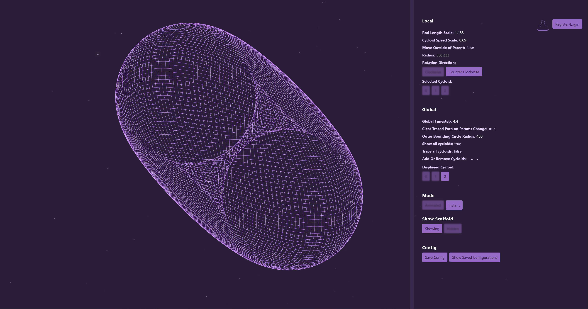

# A WebGL-WASM-Powered Spirograph Generator

## Foreword

This is project is first and foremost, my playground, where multiple ideas are tried and tested and are fully leveraged elsewhere. I initially wanted to just make a quick spirograph generator, but then stumbled into various (exciting and frustrating) rabbit holes, each hole an entire realm worth exploring on their own. They result in, dare I say, a cacophony of ideas, of trials and errors.

There are some features that I eventually stopped working on because it's been almost 2 years of me stopping and picking up where I left of like the backend integration(sorry, you only get local storage for now), some fancy UI upgrades and smaller screens support. This project was burning me out and I needed to finish it fast.

Nontheless, there are still some cool discoveries I have made that I think are worth being documented.





## Your childhood's favorite spirograph toy, but beefed up.

This spirograph generator contains 2 modes: 

1. The __animated mode__, which draws n-nested level of cycloids at 60fps. This is done on the main thread, so the frames could dip significantly if your cpu is not very powerful for single-threaded operations. I didn't take time to optimize it as it really isn't why this project exist. 
2. The __instant mode__, the reason I made this project in the first place. This mode draws very, very fast. It also guarantees that for Global Time Scale of around 1, the shape that is drawn will be a complete shape. The algorithm is discussed below, along with other implementation details.

# Parameters

## Local (affects the selected cycloid only)

`rodLengthScale`: 1 means the rod is the same length as the cycloid it belongs to. This rod extends the physical boundary in that in a real spirograph, the position of the rod cannot be farther from the origin than the radius of the circle.

`cycloidSpeedScale`: the ratio of the surface covered as the child cycloid moves around the parent. The value of 1 means there are no sliding (physically accurate).

`moveOutsideOfParent`: whether the curent cyclod is positioned within or outside of its parent cycloid. 

`radius`: The radius of the current cycloid.

`rotationDirection`: this is not the self-rotation direction, but the direction in which the current cycloid moves around its parent (going left or going right).

`selectedCycloid`: the cycloid whose parameters you would like to change.

## Global (affects every cycloids)

`globalTimeStep`: controls the iterations needed until an image is fully drawn. The higher the value, the lower the iterations...and resolution. However, set the value too low, and the image will take too long to be drawn in the animated mode, and use more power in the instant mode (more iterations).

`clearTracedPathOnParamsChanged`: whether or not to clear the already-traced paths in animated mode when the paramters are changed.

`outerBoundingCircleRadius`: the radius of the base circle. 

`showAllCycloids`: whether or not to show all cycloids (the circles). Works only in animated mode.

`traceAllCycloids`: whether or not to trace the paths of all cycloids. Works only in animated mode.

`displayedCycloid`: the cycloid whose path is currently being traced.

# The Modes

## Animated


The simplest of modes, this mode adds up the position of the current point every frame based on the current parameters of each cycloids, adding one on top of another. Nothing much to mention, I didn't even bother optimizing this and move it to another worker thread. Exciting things happen in the other mode, so let's go there instead.

## Instant


This is where most of the work goes. The rendering is done in the worker thread with an offscreen canvas. Wasm and WebGL are both used here alongside a very interesting algorithm(for me) to help make sure that we get the full, or the contour of the shape, depending on the `globalTimeStep` property, as fast as possble. 

__A brief overview of how it's done__, more detial below: grab all properties from the main thread, pass them all to the worker thread, the worker thread then sends the parameters to Rust to calculate how many points to draw for a complete shape, then calculates the position for each of the points, again, with Rust, and then pass that back to JavaScript. Now, with the positions of the vertices available (hopefully not too many points until the heap oveflows :p) in memory, we pass all of that to WebGL's `drawArrays` and all lines are drawn at once.

### The Algorithm

The problem with numeric methods is that it's long, and you don't know when it'll end, or if the end is really the end?! Too few iterations and the shape won't be complete, and too many means wasting computation time.

Let's say we check

```ts
if (currentPoint.xy === beginningPoint.xy) {
    draw();
}
```

every iteration, what's going to happen is that for shapes other than the simple geometric 2d shapes, this will not draw the full shape. Given complex enough shapes, lines will cross and the check will fail.

Okay, let's say we now just keep drawing for say, a million iterations, that'll for sure get the complete shape, right? Right, but those over-draw will make the lines too thick that we can't really make out the finer details of the shape.

Worse, every shape will just take super long.

__Our solution__ would be to find out how many iterations each shape need.

Let's begin with the formula.

Right now, we build each circle on top of one another, and each movement of the circle is affected by the product of the scalars of all circles below it. This can be described as:


$$ p_{final} = \sum_{i=0}^{n} \cos(\theta \lambda - \frac{\pi}{2}k)(r_{p} + r_{c}) $$

Where $p_{final}$ represents the final position, either `p.x` or `p.y` of the current point. $n$ is the total number of cycloids considered in the calculation. $k$ is a constant with a value of either 1 or -1, used to offset the cosine function and determine whether the cycloid is inside or outside of its parent. $r_p$ and $r_c$ are the radii of the parent of the current cycloid and the cycloid itself, respectively. $\theta$ is the current angle of the cycloid. And $\lambda$ is a scalar that determines the speed at which the cycloid moves around its parent.

Yes I am sounding very pretentious. I should know, because I didn't start with the equation, I  I actually started with this:

```ts
  for (let i = 1; i < cycloids.length; i++) {
      const parentCycloid = cycloids[i - 1];
      const thisCycloid = cycloids[i];
      const childCycloidRadius = thisCycloid.isOutsideOfParent
        ? thisCycloid.radius
        : -thisCycloid.radius;
      const isChildArcClockwise =
        thisCycloid.rotationDirection === "clockwise"; // js hack, true is 1, and false is 0

      // We ask the child it needs the parent to scale its theta.
      finalPoint.x +=
        (parentCycloid.radius + childCycloidRadius) *
        Math.cos(
          theta * thisCycloid.thetaScale - Math.PI * 0.5 * isChildArcClockwise 
        );
      finalPoint.y +=
        (parentCycloid.radius + childCycloidRadius) *
        Math.sin(
          theta * thisCycloid.thetaScale + Math.PI * 0.5 * isChildArcClockwise
        );
    }
```

then I turned it into Rust, with a few optimizations (that are totally not necesary, but did it anyway because it was actually kind of fun):

```rs
pub fn compute_epitrochoid(
    data: *const [f64; 3],
    data_len: usize,
    theta: f64,
    rod_length: f64,
    new_point: &mut [f64; 2],
) {
    *new_point = [0.0, 0.0];
    // Don't ask why I used unsafe, I forgot :| Something something with not doing borrow checking.
    unsafe {
        for i in 0..data_len {
            let d = *data.add(i);
            new_point[0] += d[0] * (theta * d[2] - d[1]).cos();
            new_point[1] += d[0] * (theta * d[2] + d[1]).sin();
        }

        new_point[0] += rod_length * theta.cos();
        new_point[1] += rod_length * theta.sin();
    }
}
```

Okay. Now we know how to sum up the final position of our points. But we still don't know how many iterations we need. 
Let's first think about each rotation as just 2 different pair of 2 trig functions ${cos(x)}$ and ${cos(0.5x)}$, and ${cos(2x)}$ and ${cos(3x)}$.


In the case of a cosine, the second time $cos(\theta_{1})$ and $cos(\theta_{2})$ equal ${1}$ is the moment we know we need to stop the iteration.

So this means that we can just keep looping until we hit ${1}$...right?:

```ts
  const stepsNeededForEachIteration = 60;
  const k = (Math.PI / 2) / stepsNeededForEachIteration;
  for (let i = 0; i < Number.Infinity; i++) {
    const theta = 0.289;
    const phi = 0.948;
    const whateverGreekLetterIsNext = 2.99;
    while(Math.cos(theta) === 1 && Math.cos(phi) === 1 && Math.cos(whateverGreekLetterIsNext) === 1) {
      draw();
      theta += k;
    }
  }
```

Of course not. Like, we are doing numerical integration, this means that there is a chance ${\theta + k}$ will never be equal to one, especially when there are a lot of decimal places and when there are more than a few scalars. We NEED to find out ahead of time, and the algorithm must not be _O(?)_ where ${?}$ is who the hell knows when it'll end. We need something FASTER. 

There are actually two things that could help us here from our elementary math classes: gcd and lcm.

We would like to find out basically when ${n}$ numbers "collide", which is a perfect problem from our two friends! But the question now is...which one do we need?

A refresher: lcm returns a number that is divisible by each of the numbers passed as argument, and gcd returns the number that all input numbers are divisible by.

```ts
lcm(8, 12); // 24
lcm(2, 5, 6); // 30
lcm(10, 100, 200) // 200
gcd(8, 12); // 4
gcd(2, 5, 6); // 1
gcd(10, 100, 200) // 10
```

Let's try to predict when _three_ cosine functions collide. This time, we'll do it with numbers less than one. Reason being...that's how I started.

Let's see, when do you think ${cos(0.5x)}$, ${cos(0.25x)}$, and ${cos(0.125)}$ collide?

If we look at them as fractions, things become much easier:

For this set of numbers, if we inspect the graph:

$$ {\{\frac{1}{2}, \frac{1}{4}, \frac{1}{8}\}} $$

$$ {cos(\frac{1}{2}x)} $$


$$ {cos(\frac{1}{2}x), cos(\frac{1}{4})} $$


$$ {cos(\frac{1}{2}x), cos(\frac{1}{4})}, cos(\frac{1}{8}) $$


Now, I'm not sure if this is how people prove their mathmatical reasoning, but I can clearly see that our base oscillation of ${2\pi}$ is scaled by the `lcm` of the denominator. 

```ts
lcm(2, 4); // 4
lcm(2, 4, 8); // 8
```

So let's try turning our decimal numbers into fractional number and take the `lcm` of the denominators.

```ts
const result = lcm(numbers.map((n) => getDenominator(n)));

// https://www.mathsisfun.com/converting-decimals-fractions.html
function getDenominator(n) {
  // If an integer, the denominator is one.
  if (n % 1 === 0) return 1;

  // find out how many decimal place this number has.
  const decimalPlaceCount = n.toString().split(".")[1];
  const numerator = Math.pow(10, decimalPlaceCount);
  const denominator = numerator * n;
  const divisor = gcd(numerator, denominator);  

  // We don't care about the simplified numerator.
  denominator /= divisor;         
  return denominator;
}
```

And this works for all numbers?? Yes it does!. However, we are doing `gcd` twice (the `lcd` algorithm includes calculating `gcd`), let's try to make it a bit easier.

So if we walk through the calculation.

Give the 2 numbers to the function.

$$ {f(0.5, 0.25, 0.125)} $$

Turn into decimal numbers.

$$ {\frac{0.5 * 10}{10}, \frac{0.25 * 100}{100}, \frac{0.125 * 100}{100}} $$

$$ {\frac{5}{10}, \frac{25}{100}, \frac{125}{1000}} $$

Find the divisor with `gcd` and simplify.

$$ {\frac{1}{2}, \frac{1}{4}, \frac{1}{8}} $$

Then take the `lcm` of the two denominators.

$$ {lcm(2 ,4, 8)} $$

Which is basically

$$ {x_1 = \frac{|2 * 4|}{gcd(2 ,4)}} $$

$$ {x_2 = \frac{|x_1 * 8|}{gcd(x_1 ,8)}} $$

$$ {x_2 = 8} $$

Did you notice something? I didn't. My math genius friend had to point it out to me. In the second steps, we already have all the information we need, after having turned everything into decimals.

The final result is actually just the result of 

$$ {\frac{1000}{125}} $$

When we had only 0.5 and 0.25, it was 

$$ {\frac{100}{25}} $$

So apparently, it is the result of the one of the max dedcimal place of all numbers divided by some numbers ${x}$ and that ${x}$ issssss:

$$ {f(0.5, 0.25, 0.125)} $$

The max decimal of the 3 is 0.125, so 3 zeros.

$$ {m = 1000} $$

$$ {0.5 * m, 0.25 * m, 0.125 * m} $$

$$ {500, 250, 125} $$

$$ {x = gcd(500, 250, 125)} $$

$$ {x = 125} $$

Then 
$$ \text{result} = {m/x} $$

All done!

In short, what we did above was, for all numbers ${n}$, we multiply by ${m}$, and then divide ${m}$ by the `gcd` of those numbers.

$$ \forall n \in \text{numbers}, n \gets n \times m $$
$$ \text{result} = {m / gcd(numbers)} $$ 

Now we have the number of points we neeed and the way for us to some up the final position of each of the point to be drawn. Now we can just loop over those points like and draw those points!

```ts
// For a more detailed version, look at calc_points/lib.rs

// We need to compensate a bit, based on how fast, or slow the animation is.
const times = compensate(result, timeStepScalar);
let theta = 0;
for (let i = 0; i < result; i++) {
  theta += step; 
  let p = sumUpPoints(cycloids);
  draw(p);
}
```

That looks good and all, but just encountered another problem. Drawing for thousands, tens or hundreds of thousands, or million times is slow...very slow.

So far, I didn't talk about how we implement the `draw` method. If the `draw` method were to be implemented like this:

```ts
function draw(p) {
  ctx.beginPath(p);
  ctx.moveTo(p.previuos.x, p.previous.y);
  ctx.lineTo(p.current.x, p.current.y);
  ctx.stroke();
}
```
it will just take forever. We want that smoothness. And this is where WebGL comes in.

## WebGL

I wrote a small custom-made webgl renderer because other options are too generic and would definitely bloat the project. This renderer does nothing but render a bunch of lines with and API that is not too complicated. My rendering use case is very simple, I only need 3 methods:

```ts
export default interface Renderer {
  render(): void;
  resize(newWidth: number, newHeight: number): void;
  setTransformation(mat: { x: number; y: number; z: number }): void;
}
```

The `render` method is called everytime there is a change to the parameters, a resize happens, a transformation is applied to the matrix (zoom, pan), or the focused cycloid has changed. I could have gone with caching the rendered output and added a debounce or throttle wrapper to minimize the rendering time, but doing that would mean losing the ability to see the change animating as the parameters change in real time. Instead, the `globalTimeStep` property can be used to help improve the performance, when the renderer takes too long. 

In the render method, I used webGL's drawElements or drawArrays to help me draw all the lines (2 points) all at once. This means that I have to put the points into an array and then pass them all to the renderer.

```ts
const points = [];
const times = compensate(result, timeStepScalar);
let theta = 0;
for (let i = 0; i < result; i++) {
  theta += step; 
  let p = sumUpPoints(cycloids);
  points.push(p);
  // draw(p) << No longer needed
}

// ...

renderer.render(points)

render(points: Point[]) {
  // ...
  gl.bufferData(
    gl.ARRAY_BUFFER,
    new Float32Array(points),
    gl.STATIC_DRAW
  );
  const linesCount = points.length / 2;
  gl.drawArrays(gl.LINES, 0, linesCount);
}
```

Now we have reduced the rendering time from seconds to a tenth or a hundredth of milliseconds for most render. That is more than a thousand times faster!

### __But we can do a bit better.__

## WASM

Why Rust-WASM and not just JavaScript?

After having profiled multiple times (like a lot), WASM seems to gives better results when dealing with lower iterations. With larger iterations (~500,000 or more), JavaScript's JIT compiler comes in and steals the victory. With globalTimeStep being an option, and most combinations of cycloidSpeedScale result in iterations less than the limit that I found, I see it fitting that we go with Rust for this small calculation util. Hopefully, future improvements made to WASM will also give this function some performance boost as well.

The wasm modules can be in charge of finding out how many points we need to draw, and the positions for each of the points. Had we not moved the rendering to WebGL, this wouldn't have been possible, as we would have needed to call a `draw` method within each loop. But now that we don't, we can do this:

```rs
// shortened version of calc_lines/lib.rs

// ...some set up code
for _ in 0..points {
    new_point = compute_epitrochoid(
      data_for_computation
    );

    if first_time {
        first_time = false;
    } else {
      arr.push(prev_point[0]);
      arr.push(prev_point[1]);
      arr.push(new_point[0]);
      arr.push(new_point[0]);
    }

    prev_point = new_point;

    theta += step;
}

arr // return result to JavaScript
```

Could I have made this feature in JavaScript? Yes! Actually, the feature was made in JavaScript and then I later switched to Rust. JavaScript was actually not slow at all and I'm sure that had I not made the changed, the rendering would appear to the eyes just as fast. But, hey...I learned Rust!

That concludes all the stuff about rendering our result as fast as possible, and it's very beautiful, I have to admit.

But oh no, our journey does not end here. There was more to do.

# Zooming and Panning

So our drawn spirograph can get very, very intricate. Sometimes, we just want to be able to zoom in and see stuff!

Like this one.


Those four corners, top, left, button, right, looks really interesting. Would be nice if we could do something like this.


Oh that's right. We could already do that! Unfortunately, walking through the zooming and panning would take too long. This article is already too long! For the zoom and pan, I intended to make a library out of it. A framework-agnostic library that just concerns itself with zoom and pan logic. Nothing else. Should be compatible with webgl, canvas, svg, etc. So far, I think I'm more than half way there and it needs some more work. I'll write a separate article documenting my journey there.

# Relationship Editor

Ok one last thing.


There is this thing here, which is still a bit (just a bit) buggy, but I'm like screw this, I'm moving on to other projects.

The relationship editor allows you to re-define the parent-child cycloid between each of the cycloid. This definitely called for some kind of tree-like data structres. 

_animated mode_


_instant mode_


## The UI

I must admit I have made a mistake of drawing it with SVG. This made the interaction difficult to handle because now I have to involve the DOM API and CSS. This introduced some bugs that I didn't bother fixing. 

I have a `generateNode` hook that is called everytime the menu is switched to a relationship editor. Within the hook, I have a sort of a NodeLevel manager that keeps track of the "level" each node resides in. The level is determined by having each node recursively travel up its chain until it meets the base node, the `outerBoundingCircle`.
 
```ts
// getDrawLevel.ts
// I removed the error-handling code to make this a bit more readable.
function getCurrentDrawLevel(
  parentId: number,
  cycloidControls: React.MutableRefObject<CycloidControls>,
  levelCounter: number,
  currentId: number,
  cache: Record<number, number> // For memoization
): number {
  // If has gone through this parent before, return immediately with the parent's level.
  if (cache[parentId]) {
    return levelCounter + cache[parentId];
  }
  if (parentId === -1) {
    cache[currentId] = levelCounter;
    return levelCounter;
  }
  let parentParams =
    cycloidControls.current.cycloidManager.getSingleCycloidParamFromId(
      parentId
    );
  const grandParentIndex = parentParams!.boundingCircleId; 

  return getCurrentDrawLevel(
    grandParentIndex,
    cycloidControls,
    levelCounter + 1,
    currentId,
    cache
  );
```

Once we know the level of each of the nodes, we specify an arbitrary space between each level, __calculate the positions__, and then we can begin placing them.

## Calculating the Positions

### Placing the Circles

To place the circles like this:


We first need to be able to do this:


For any ${n}$ level, I have defined the positioning like this

```ts
for (let i = 0; i < thisLevelNodeCount; i++) {
    // xPos is just placing the nodes out with nodeMargin * i margin, starting from center.
    const xPos = nodeCenter.x + nodeMargin * i;
    // xOffset is the offset we need to do to get the row to be in the center.
    // It should be half the full span of the row, which is:
    const xOffset = (nodeMargin / 2) * (thisLevelNodeCount - 1);
    ctx.beginPath();
    ctx.arc(xPos - xOffset, nodeCenter.y + someYOffset, someRadius, 0, Math.PI * 2);
    ctx.fill();
  }
```

And then we'll just have to make sure that when we place the nodes, each child stays close to their parents so that we can draw a straight line from it to its parent without crossing over other higher-level nodes.

```ts
  nodesOnLevel.sort((a, b) => (a.parentId ?? -1) - (b.parentId ?? -1));
```

Now all is good and well, with a lot of nodes, when we traced the lines, they look funny sometimes, but that's good enough for out use case. 


### Placing the Lines

## Error-Handling

### Wrapping up

So in this rabbit hole journey, I learned Rust TO 

